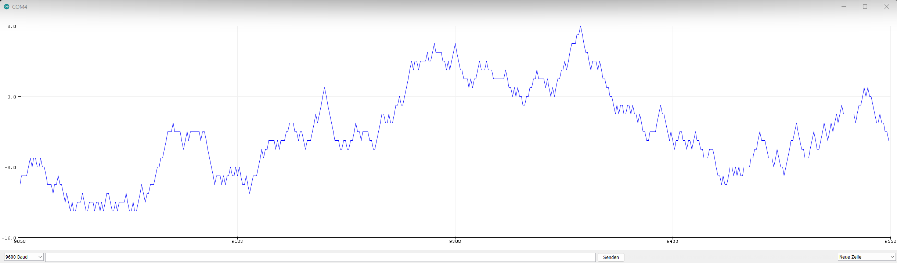
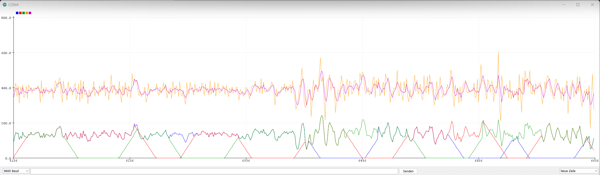

# AudioRGB

## Arduino Pinout

| Pin  | Mode            | Component    | Data            |
| ---: | :-------------- | :----------- | :-------------- |
|  $6$ | `output`        | LED left     | red             |
|  $5$ | `output`        | LED left     | green           |
|  $3$ | `output`        | LED left     | blue            |
|      |                 |              |                 |
| $11$ | `output`        | LED right    | red             |
| $10$ | `output`        | LED right    | green           |
|  $9$ | `output`        | LED right    | blue            |
|      |                 |              |                 |
|  $2$ | `input pull-up` | touch pad    | pad 1           |
|  $4$ | `input pull-up` | touch pad    | pad 2           |
|  $7$ | `input pull-up` | touch pad    | pad 3           |
|  $8$ | `input pull-up` | touch pad    | pad 4           |
|      | `             ` |              |                 |
| $A0$ | `input pull-up` | analog audio | left channel    |
| $A1$ | `input pull-up` | analog audio | right channel   |
|      |                 |              |                 |
| $A2$ | `input`         | *nothing*    | *floating-bits* |
| $A3$ | `input`         | *nothing*    | *floating-bits* |

## Results

**[Random walk](https://en.wikipedia.org/wiki/Random_walk) by reading analog floating bits**

| Graph | Data        |
| :---- | :---------- |
| blue  | random walk |

***

**Fade random color in / out while playing music**

| Graph  | Data           | y-value    |
| :----- | :------------- | :--------- |
| yellow | audio          | volume     |
| purple | filtered audio | volume     |
| red    | red value      | brightness |
| green  | green value    | brightness |
| blue   | blue value     | brightness |
