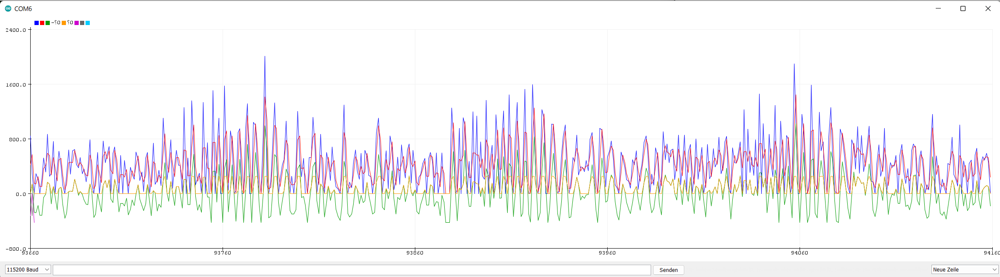

# AudioRGB

&nbsp;

## Arduino Uno

### Pin Configuration

| Pin  | Mode            | Label     | Component    | Data            |
| :--- | :-------------- | :-------- | :----------- | :-------------- |
| `6`  | `pwm output`    | `LED_L_R` | LED left     | red             |
| `5`  | `pwm output`    | `LED_L_G` | LED left     | green           |
| `3`  | `pwm output`    | `LED_L_B` | LED left     | blue            |
|      |                 |           |              |                 |
| `11` | `pwm output`    | `LED_R_R` | LED right    | red             |
| `10` | `pwm output`    | `LED_R_G` | LED right    | green           |
| `9`  | `pwm output`    | `LED_R_B` | LED right    | blue            |
|      |                 |           |              |                 |
| `2`  | `input pull-up` | `TCH_1`   | touchpad     | pad 1           |
| `4`  | `input pull-up` | `TCH_2`   | touchpad     | pad 2           |
| `7`  | `input pull-up` | `TCH_3`   | touchpad     | pad 3           |
| `8`  | `input pull-up` | `TCH_4`   | touchpad     | pad 4           |
|      |                 |           |              |                 |
| `A0` | `input`         | `AUX_L`   | analog audio | left channel    |
| `A1` | `input`         | `AUX_R`   | analog audio | right channel   |
|      |                 |           |              |                 |
| `A2` | `input`         | `RNG_1`   | *none*       | noise           |
| `A3` | `input`         | `RNG_2`   | *none*       | noise           |

### Results

**[Random walk](https://en.wikipedia.org/wiki/Random_walk) by analog reading of noise from pin `A2`**

| Graph | Data        |
| :---- | :---------- |
| blue  | random walk |

***

**Fade random color in / out while playing music**

| Graph  | Data           | Value      |
| :----- | :------------- | :--------- |
| yellow | audio          | volume     |
| purple | filtered audio | volume     |
|        |                |            |
| red    | red value      | brightness |
| green  | green value    | brightness |
| blue   | blue value     | brightness |

## Nucleo-64

### Pin Configuration

| Pin Name | GPIO mode            | GPIO Config | User Label  | Component        | Data                |
| :------- | :------------------- | :---------- | :---------- | :--------------- | :------------------ |
| `PB6`    | `pwm output`         | `TIM4_CH1`  | `LED_R`     | LED left         | red                 |
| `PC7`    | `pwm output`         | `TIM3_CH2`  | `LED_G`     | LED left         | green               |
| `PB4`    | `pwm output`         | `TIM3_CH1`  | `LED_B`     | LED left         | blue                |
|          |                      |             |             |                  |                     |
| `PA1`    | `analog input`       | 12 bit      | `AUX_L`     | analog audio     | left audio channel  |
| `PA4`    | `analog input`       | 12 bit      | `AUX_R`     | analog audio     | right audio channel |
|          |                      |             |             |                  |                     |
| `PC2`    | `analog input`       | 12 bit      | `RNG`       | *none*           | noise               |
|          |                      |             |             |                  |                     |
| `PA2`    | `USART asynchronous` | 115200 baud | `USART2_TX` | Serial Interface | debug data          |

### Results

**UART record while playing music**

| Graph  | Data            | Value      |
| :----- | :-------------- | :--------- |
| blue   | audio           | volume     |
| red    | filtered audio  | volume     |
|        |                 |            |
| green  | color           | brightness |
| yellow | saturated color | brightness |

## Miscellaneous

### Audio-Jack Pin Configuration

| Pin Name | Cable Color | Data          | Resistance    |
| :------- | :---------- | :------------ | :------------ |
| *Tip*    | blue        | left channel  | $\sim1\Omega$ |
| *Ring*   | orange      | right channel | $\sim2\Omega$ |
| *Sleeve* | black       | ground        | $\sim3\Omega$ |

### Differences between ARM- and AVR-assembly

[See Compiler Explorer](https://godbolt.org/z/9YzeKaqcY)
