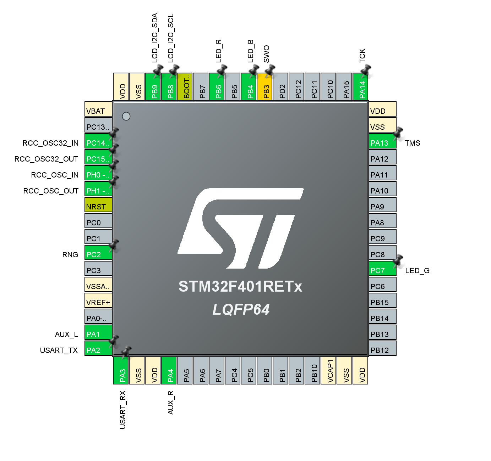

# AudioRGB

## Arduino Pin Configuration

| Pin  | Mode            | Label     | Component    | Data            |
| :--- | :-------------- | :-------- | :----------- | :-------------- |
| `6`  | `pwm output`    | `LED_L_R` | LED left     | red             |
| `5`  | `pwm output`    | `LED_L_G` | LED left     | green           |
| `3`  | `pwm output`    | `LED_L_B` | LED left     | blue            |
|      |                 |           |              |                 |
| `11` | `pwm output`    | `LED_R_R` | LED right    | red             |
| `10` | `pwm output`    | `LED_R_G` | LED right    | green           |
| `9`  | `pwm output`    | `LED_R_B` | LED right    | blue            |
|      |                 |           |              |                 |
| `2`  | `input pull-up` | `TCH_1`   | touchpad     | pad 1           |
| `4`  | `input pull-up` | `TCH_2`   | touchpad     | pad 2           |
| `7`  | `input pull-up` | `TCH_3`   | touchpad     | pad 3           |
| `8`  | `input pull-up` | `TCH_4`   | touchpad     | pad 4           |
|      |                 |           |              |                 |
| `A0` | `input`         | `AUX_L`   | analog audio | left channel    |
| `A1` | `input`         | `AUX_R`   | analog audio | right channel   |
|      |                 |           |              |                 |
| `A2` | `input`         | `RNG_1`   | *none*       | noise           |
| `A3` | `input`         | `RNG_2`   | *none*       | noise           |

## Nucleo-64 Pin Configuration

| Pin Name | GPIO mode        | GPIO Pull-up/-down  | User Label    | Component       | Data            |
|          |                  |  PWM: Timer Channel |               |                 |                 |
|          |                  |  Analog: Resolution |               |                 |                 |
| :------- | :--------------- | :------------------ | :------------ | :-------------- | :-------------- |
| `PB0`    | `pwm output`     | `TIM3_CH3`          | `LED_L_R`     | LED left        | red             |
| `PB4`    | `pwm output`     | `TIM3_CH1`          | `LED_L_G`     | LED left        | green           |
| `PC7`    | `pwm output`     | `TIM3_CH2`          | `LED_L_B`     | LED left        | blue            |
|          |                  |                     |               |                 |                 |
| `PA7`    | `pwm output`     | `TIM1_CH1N`         | `LED_R_R`     | LED right       | red             |
| `PB14`   | `pwm output`     | `TIM1_CH2N`         | `LED_R_G`     | LED right       | green           |
| `PB1`    | `pwm output`     | `TIM1_CH3N`         | `LED_R_B`     | LED right       | blue            |
|          |                  |                     |               |                 |                 |
| `PA10`   | `digital input`  | `Pull-down`         | `TCH_1`       | touchpad        | pad 1           |
| `PB5`    | `digital input`  | `Pull-down`         | `TCH_2`       | touchpad        | pad 2           |
| `PA8`    | `digital input`  | `Pull-down`         | `TCH_3`       | touchpad        | pad 3           |
| `PA9`    | `digital input`  | `Pull-down`         | `TCH_4`       | touchpad        | pad 4           |
|          |                  |                     |               |                 |                 |
| `PA1`    | `analog input`   | 12 bit              | `AUX_L`       | analog audio    | left channel    |
| `PA4`    | `analog input`   | 12 bit              | `AUX_R`       | analog audio    | right channel   |
|          |                  |                     |               |                 |                 |
| `PC2`    | `analog input`   | 12 bit              | `RNG_1`       | *none*          | noise           |
| `PC4`    | `analog input`   | 12 bit              | `RNG_2`       | *none*          | noise           |
|          |                  |                     |               |                 |                 |
| `PB8`    | `digital output` | `Pull-up`           | `LCD_I2C_SCL` | LCD Display     | I2C clock       |
| `PB9`    | `digital output` | `Pull-up`           | `LCD_I2C_SDA` | LCD Display     | I2C data        |
|          |                  |                     |               |                 |                 |
| `PC13`   | `digital input`  | `Pull-down`         | `BUTTON_OB`   | on-board button | *none*          |
| `PA5`    | `digital output` | `Pull-down`         | `LED_OB`      | on-board LED    | *none*          |

## Results

**[Random walk](https://en.wikipedia.org/wiki/Random_walk) by reading analog floating bits from pin `A2`**

| Graph | Data        |
| :---- | :---------- |
| blue  | random walk |

***

**Fade random color in / out while playing music**

| Graph  | Data           | Value      |
| :----- | :------------- | :--------- |
| yellow | audio          | volume     |
| purple | filtered audio | volume     |
|        |                |            |
| red    | red value      | brightness |
| green  | green value    | brightness |
| blue   | blue value     | brightness |
